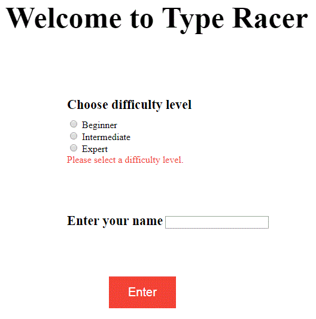
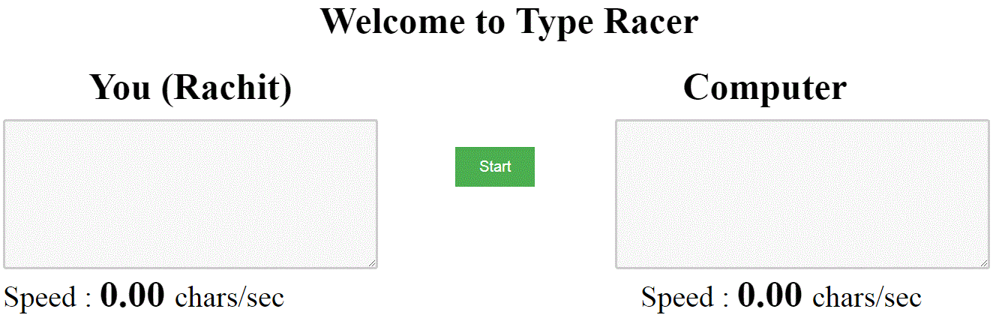
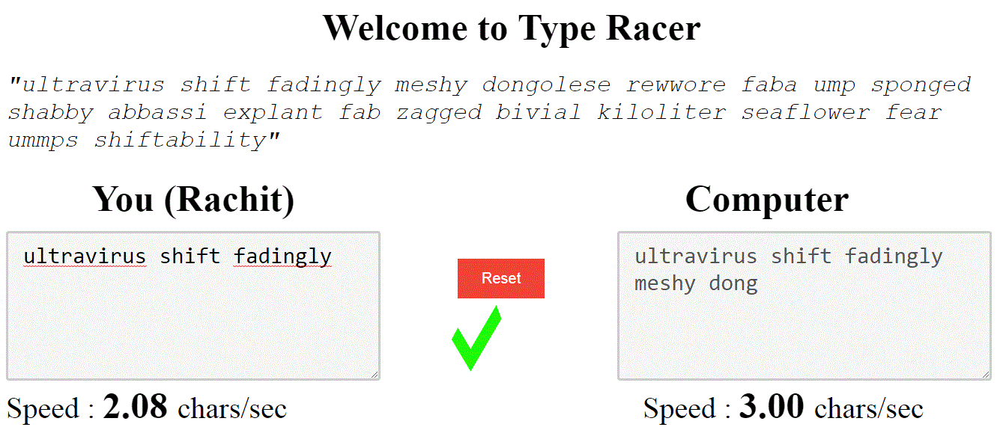
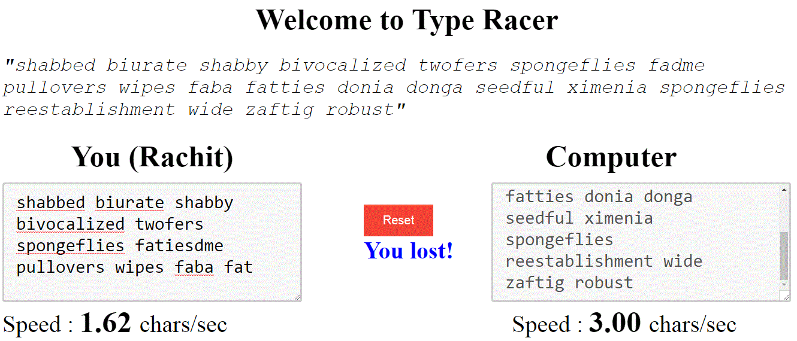

# TypeRacer
A lightweight type-racing game (played against computer) built with JavaScript and AngularJS framework that can be played in a browser itself (**Requires no installation, internet-connection!**).

## How to play the game 

Download the repository - [TypeRacer](https://github.com/gbelwariar/TypeRacer) and run **type-racer.html** (*TypeRacer/public_html/type-racer.html*) by serving it from a server using any browser(*I prefer to bring up the in-built server embedded in IDEs like - Netbeans to avoid setting up a Node.js server. A server is required to avoid [this](https://stackoverflow.com/questions/10752055/cross-origin-requests-are-only-supported-for-http-error-when-loading-a-local) error*).

## Screenshots (when played in Chrome Browser)

### → Home Page

 

### → Before the game starts

 

### → During the game (the below screenshot is of "Basic" difficulty level)

 

### → When the game ends (the below screenshot is of "Basic" difficulty level)

 

## Languages/Frameworks Used - 

1) JavaScript  
2) AngularJS (1.x)
3) [Jasmine](https://jasmine.github.io/) (For unit-testing)
4) HTML
5) CSS

## Phases of the Projects

**1. Requirements** - Any browser would work. An internet connection is not required. 
**2. Design** - Angular's routing technique is not used in this project. Instead the current implementation just removes/hides the various DOM elements, thus maintaining the same URL throughout the game. 
**3. Implementation** - Refer to the "**Languages/Frameworks Used**" section above to know the technologies used in this project. 
**4. Testing** - The tests can be found [here](https://github.com/gbelwariar/TypeRacer/tree/master/test) and [here](https://github.com/gbelwariar/TypeRacer/tree/master/test/jasmine). These are organized in a similar fashion as the main implementation files. 
**5. Maintenance** - Any suggestions to improve the projects are welcome on gbelwariar@gmail.com or can be directly sent as a PR. 

## Components of the Projects

Name of the Component                                                                                                    | Description
-------------------------------------------------------------------------------------------------------------------------| -------------
[**Home Screen**](https://github.com/gbelwariar/TypeRacer/blob/master/public_html/type-racer-controller.js)              | This is the component to which all the other components are loosely coupled with. It is responsible for the following tasks -  1) Fetching the difficulty level and name from the user playing the game.  2) Initialization of the game.
[**Gameplay**](https://github.com/gbelwariar/TypeRacer/tree/master/public_html/gameplay)                                 | Responsible for the following tasks -  1) Resetting the game variables everytime the game is reset.  2) Installation of the timer responsible for the countdown till the game starts.  3) Calculation of the live speed of the human-entered input.                                                                                        
[**Live Results**](https://github.com/gbelwariar/TypeRacer/tree/master/public_html/live-results)                         | Responsible for the following tasks -  1) Displaying the live status which would reflect whether the text entered by the player matches with a prefix of the challenge string. If it matches then a tick (✔), otherwise a cross (✘) is displayed.  2) Declaring the winner of the game or if both the useer and the computer finishes the game at the same time then the game is said to be drawn.        
[**Dictionary Service**](https://github.com/gbelwariar/TypeRacer/blob/master/public_html/services/dictionary-service.js) | Responsible for providing the challenge string. By default the number of words in the challenge string is 20 and all the words are selected randomly out of about 600 words present in the dictionary in order to make the game unbiased. All the words are valid English words.

## Scope of improvements

1) Use Angular's Routing Technique to direct different pages of this application to different URLs. Currently, the pages are simply removed from the DOM to show up a new page which makes it harder to develop and track the flow of control and data between different pages.
2) Extend the above game to give the user an option of playing against second user (or many other users). This would require a dedicated server.
3) Use simpler words to form the challenge string. Currently, all the words are valid English words but some of them are very uncommon and unheard words which makes it harder for the user to type.
4) Simplify some of the stylesheets.
